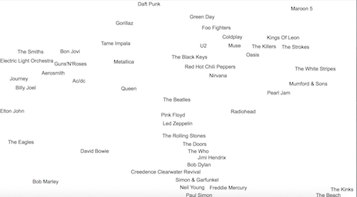

*Now that we have covered basic techniques for recommender systems, choose one commercial recommender and describe how you think it works (content-based, collaborative filtering, etc). Does the technique deliver a good experience or are the recommendations off-target?*

##INTRODUCTION TO GNOD  

Gnod is an acronym for "Global Network of Discovery", and started out as a personal project for programmer  and AI designer Marek Gibney. Gnod has been around since 2002, before media streaming and their recommendation engines (YouTube, Spotify, etc.) existed.  

Gnod actually has five separate recommendation systems: 

- Gnoosic for music recommendations by band/artist
- Gnooks, for literature recommendations by author
- Gnovies, for movie recommendations
- Gnod Art, for visual artist recommendations
- Product Chart, for recommendation of consumer electronics  

To keep things brief, Gnoosic will be the focus of this discussion.  

##GNOOSIC: MUSICAL ARTIST RECOMMENDER  

According to the website (www.gnoosic.com), "Gnod is a self-adapting system that learns about the outer world by asking visitors what they like and what they don't like.". Gnod makes recommendations by asking a user to input three bands (artists) they know (and like already) into a simple interface.  

  

Based on the initial three artists, Gnoosic will recommend the name of an artist that other users who like the artists you entereed also like. Under the artist/band name will be three choices of "I like", "I don't like", and "I don't know". If the user selects like/don't like, Gnoosic will continue to recommend other artists. Gnoosic will also recommend artists after selecting "I don't know", but will stop recommending after consecutive selections. 

  

Gnoosic does not provide URLs to artist websites, audio or video samples, or any other information. The idea is for the user to take the recommendations and do their own deeper exploration into the artists, though this may be easier if the ability to do it directly from the page existed. Also depending on the user input, Gnoosic will create a summary, showing what was input to start the recommendations, and the resulting choices for the recommended artists that followed.  

  

##HOW IT WORKS  

Gnoosic, and the other recommendation engines under Gnod, use item-based collaborative filtering using explict data collection. That is, the user is asked to input the items they already like, and next, asked to rate an artist/band that they may or may not know. While the particulars of the algorithm are not widely documented, Gnoosic most likely makes recommendations based on the "distance" (cosine similarity, Pearson correlation, or something more complex) between items in the database. Since there is no log-in or profile, the similarity of users is most likely based off of the initial artists entered in the search, and then which artists they like/don't like following that.  

Aside from the recommended musical artists returned by Gnoosic, the user can also view the "music map", which is really just a visualization of the graph database that the information is most likely stored in. However, instead of viewing the music "map" of the artists searched for and rated previously, a user can type artists names directly into the search bar and get a visual representation of similar artists.

  

##CONCLUSION  

Gnoosic is not built into another application for content consumption, and solely exists as a way for users to find new musical artists. The user interface, and overall design of the site are very clean and simple - enter results, get some results back.  

From personal experience, the artists recommended by Gnoosic do seem to all have something in common, whether it be the genre, era the main body of work is from, overall popularity in pop culture, etc. I have found some new artists to listen to from the service, and don't find too many recommendations that are out in left field. Mixing up artists from different genres/eras/notoriety level will sometimes yield interesting results (mostly in a positive way). 

As far as negatives with the system, the artist entries are submitted and edited by the users, and Gnoosic has a system for validating entries. Still, typos and incorrect artist names are sometimes recommended. Also mentioned earlier, the lack of the any links or samples of artist work leaves more of the discovery process up to the user. However, most music fans eager to find something new are generally happy to take a list of band names and sample tracks on their own.  This model may stand the test of time with modern ways of consuming musical content (Spotify playlists or similar systems) becoming the status quo.  

Overall, if you're looking for a fast and relatively painless way to be recommended new content without creating user profiles, signing up for a service, navigating menus, Gnoosic is a solid recommendation system.  